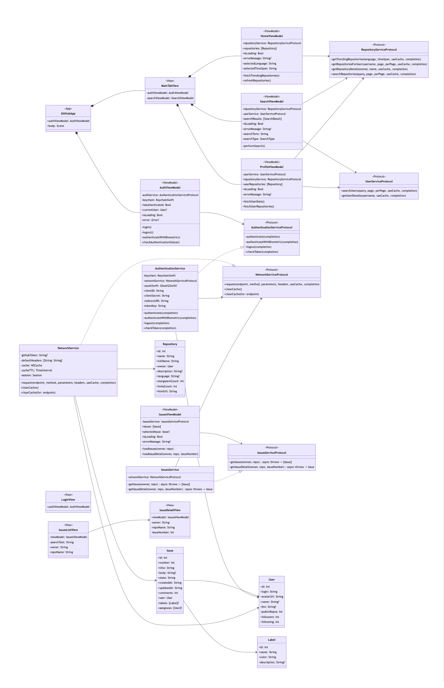

# GitHub iOS 应用架构图表

本目录包含GitHub iOS应用的架构设计图表，使用Mermaid Markdown格式创建。

## 文件说明

- `Component-Diagram.mmd`: 应用组件架构图，展示不同层级及其依赖关系
- `Class-Diagram.mmd`: 应用类图，展示主要类及其关系
- `Login-Sequence-Diagram.mmd`: 登录流程序列图，详细展示三种登录方式的流程

## 如何预览这些图表

由于Mermaid是基于文本的图表格式，您需要使用支持Mermaid的工具来预览这些图表：

### 方法1: 使用VS Code (推荐)
1. 安装VS Code编辑器
2. 安装"Markdown Preview Mermaid Support"扩展
3. 打开MMD文件
4. 按`Cmd+Shift+V`(Mac)或`Ctrl+Shift+V`(Windows)预览

### 方法2: 使用在线编辑器
1. 访问[Mermaid Live Editor](https://mermaid.live/)
2. 复制MMD文件内容到编辑器左侧
3. 右侧将显示渲染后的图表

### 方法3: 导出为PNG/SVG格式
要将图表导出为图片格式，您可以：

1. 使用Mermaid命令行工具：
   ```bash
   # 安装工具
   npm install -g @mermaid-js/mermaid-cli
   
   # 转换为PNG
   mmdc -i Component-Diagram.mmd -o Component-Diagram.png
   mmdc -i Class-Diagram.mmd -o Class-Diagram.png
   mmdc -i Login-Sequence-Diagram.mmd -o Login-Sequence-Diagram.png
   ```

2. 或使用在线编辑器导出:
   - 在[Mermaid Live Editor](https://mermaid.live/)中渲染图表
   - 点击右上角"Export"按钮
   - 选择PNG或SVG格式下载

## 修改图表

如需修改这些架构图表：
1. 使用文本编辑器编辑相应的MMD文件
2. 使用上述方法预览修改效果
3. 导出更新后的图片以更新文档

## 图表渲染示例

图表在README中的渲染效果示例：





注意: 请确保导出这些PNG文件并放置在此目录中，以便README中的图片链接正常显示。 