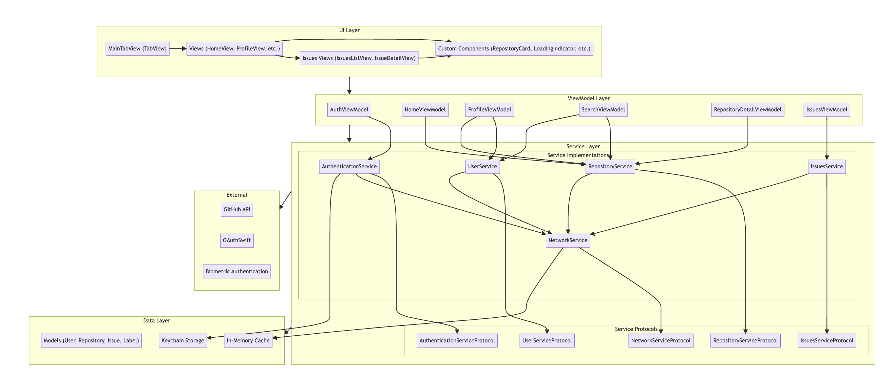

# GitHub iOS App

This is an iOS client application based on the GitHub API, developed using Swift and SwiftUI/UIKit. This application follows Protocol Oriented design principles and adopts the MVVM architecture pattern.

## Main Features

- **Authentication**: GitHub OAuth login and biometric authentication (Face ID/Touch ID)
- **Content Browsing**:
  - Popular repositories display (accessible without login)
  - Repository details (includes basic information, README display)
  - Code browsing (supports viewing repository code structure within the app)
  - Issues management (native implementation, supports list browsing, search, label display, and detail viewing)
  - User profile display
- **Search Functionality**: Supports searching repositories, users, and organizations
- **UI & Experience**:
  - Custom UI components (loading animations, repository cards, etc.)
  - Unified error handling mechanism
  - Full dark mode support
  - Chinese localization
  - Adapts to various screen sizes (iPhone/iPad)

## Technology Stack

### Core

- **Language**: Swift 5.5+
- **UI Framework**: SwiftUI (main interfaces), UIKit (specific features and compatibility)
- **Architecture Pattern**: MVVM (Model-View-ViewModel)
- **Design Philosophy**: Protocol Oriented Programming

### Core Components

- SwiftUI views and modifiers
- Property wrappers: @Published, @StateObject, @ObservedObject
- Swift concurrency: async/await
- Protocol-based dependency injection
- Custom search and refresh implementation
- Native Issues components (supports label rendering, date formatting)

### Network and Data

- **Networking**: Alamofire
- **Image Loading**: Kingfisher
- **JSON Parsing**: SwiftyJSON
- **Secure Storage**: KeychainSwift, UserDefaults
- **API**: GitHub REST API v3

### Authentication and Security

- **OAuth Authentication**: OAuthSwift
- **Biometric Authentication**: LocalAuthentication framework
- **Secure Storage**: Keychain

### Testing and Development

- **Testing Frameworks**: XCTest, XCUITest
- **Toolchain**: Xcode 13.0+, Swift Package Manager, Git
- **Documentation**: Markdown, Mermaid (architecture diagrams)

## Application Showcase

<div align="center">
  <p>
    
  </p>
  <p><em>App Icon</em></p>
  
  <p>
    
    
    
  </p>
  <p><em>Login Screen | Biometric Login | Popular Repositories List</em></p>

  <p>
    
    
    
  </p>
  <p><em>Repository Details | User Profile | Repository Search</em></p>

  <p>
    
    
    
  </p>
  <p><em>User Search | Error Handling Screen | Issues List</em></p>

  <p>
    
  </p>
  <p><em>Issue Details</em></p>
</div>

## Architecture Design

This project uses the MVVM architecture pattern and Protocol Oriented design principles, showing the system design through the following diagrams:

### Component Architecture

<div align="center">
  
  <p><em>Shows the main components of the UI layer, ViewModel layer, Service layer, and Data layer along with their dependencies</em></p>
</div>

### Class Relationship Diagram

<div align="center">
  
  <p><em>Describes the main classes, protocols, and their relationships, showing dependency injection and inter-module communication methods</em></p>
</div>

### Login Flow Diagrams

<div align="center">
  <h4>OAuth Login</h4>
  
  <p><em>Complete authorization through the GitHub website</em></p>
  
  <h4>Biometric Login</h4>
  
  <p><em>Verify identity using Face ID or Touch ID</em></p>
  
  <h4>Automatic Login</h4>
  
  <p><em>Verify saved tokens when the application starts</em></p>
</div>

> Diagrams are created using Mermaid syntax, source files are located in the `Designs/diagram/` directory. You can preview them using editors that support Mermaid or the [Mermaid Live Editor](https://mermaid.live/).

## Project Setup and Configuration

### System Requirements

- iOS 14.0+
- Xcode 13.0+
- Swift 5.5+

### Dependency Management

Add the following dependencies using Swift Package Manager (SPM):

| Package Name | URL | Version | Purpose |
|-------|-----|------|-----|
| Alamofire | https://github.com/Alamofire/Alamofire.git | 5.6.0+ | Network requests |
| Kingfisher | https://github.com/onevcat/Kingfisher.git | 7.0.0+ | Image loading and caching |
| SwiftyJSON | https://github.com/SwiftyJSON/SwiftyJSON.git | 5.0.0+ | JSON parsing |
| KeychainSwift | https://github.com/evgenyneu/keychain-swift.git | 20.0.0+ | Secure storage |
| OAuthSwift | https://github.com/OAuthSwift/OAuthSwift.git | 2.2.0+ | OAuth authentication |

### Authentication Configuration

#### GitHub OAuth Configuration

1. Register an OAuth application on GitHub (https://github.com/settings/applications/new)
   - Callback URL: `github://callback`
2. Update credentials in `AuthenticationService.swift`:
   ```swift
   private let clientID = "YOUR_GITHUB_CLIENT_ID"
   private let clientSecret = "YOUR_GITHUB_CLIENT_SECRET"
   ```
3. Configure URL Scheme (Info.plist): `github`

#### Biometric Authentication Configuration

Add the `NSFaceIDUsageDescription` key and usage description in Info.plist

## Project Structure

```
GitHub-iOS/
├── Designs/                # Design resources and diagrams
│   └── diagram/            # Architecture diagrams (Mermaid)
├── GitHub/                 # Main project directory
│   ├── GitHub/             # Application source code
│   │   ├── App/            # Application entry point and configuration
│   │   ├── Models/         # Data models (User, Repository, Issue, Label, etc.)
│   │   ├── Views/          # UI views
│   │   │   ├── CustomComponents/ # Custom UI components (LoadingIndicator, RepositoryCard, WebView, etc.)
│   │   │   ├── MainTabView.swift # Main tab view
│   │   │   ├── HomeView.swift    # Home view
│   │   │   ├── RepositoryDetailView.swift # Repository details
│   │   │   ├── IssuesListView.swift # Issues list
│   │   │   ├── IssueDetailView.swift # Issue details
│   │   │   ├── ProfileView.swift  # User profile
│   │   │   ├── SearchView.swift   # Search view
│   │   │   └── LoginView.swift    # Login view
│   │   ├── ViewModels/     # View models (corresponding to each feature)
│   │   ├── Services/       # Service layer
│   │   │   └── Protocols/  # Service protocols
│   │   ├── Utilities/      # Utility classes and extensions
│   │   │   ├── AppConstants.swift # Centralized constants management (API keys, endpoints, UI values)
│   │   │   └── AppStrings.swift   # Centralized string constants (UI text, error messages, logs)
│   │   └── Assets.xcassets # Application resources
│   ├── GitHubTests/        # Unit tests
│   └── GitHubUITests/      # UI tests
├── Screenshots/            # Application screenshots
└── Tests/                  # Test documentation
```

### Utilities

#### Constants Management

The project implements a centralized approach for managing constants and strings:

- **AppConstants.swift**: Provides structured access to all constants used throughout the app:
  - GitHub API related constants (client ID, secrets, endpoints)
  - Keychain storage keys
  - Network parameters (timeouts, cache TTLs, HTTP headers)
  - UI related values (animations, sizes, padding)
  - System image names

- **AppStrings.swift**: Centralizes all string literals in the application:
  - Authentication related strings (button texts, messages)
  - Tab bar item titles
  - Network log formats
  - Cache related messages
  - Error messages

This organization improves maintainability by keeping all constants in one place and makes localization easier.

## Testing

The project includes a comprehensive test suite, detailed documentation:
- [Unit Test Documentation](Tests/UNIT_TESTS.md)
- [UI Test Documentation](Tests/UI_TESTS.md)

Features:
- Modular and reusable test design
- Shared helper methods to improve test stability
- Automatic screenshot capture for UI verification

## Development and Support

### Development Team

- Dishcool - Lead Developer

### License

This project is licensed under the MIT License