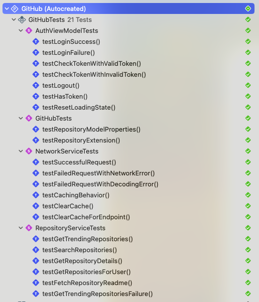

# GitHub iOS App Unit Tests

## Test Overview

This project contains the following major test suites:

1. **AuthViewModelTests** - Tests for authentication view model functionality
   - Tests login success and failure flows
   - Tests token checking and validation
   - Tests logout functionality
   - Tests state reset functionality

2. **NetworkServiceTests** - Tests for network service layer
   - Tests successful and failed network requests
   - Tests caching functionality
   - Tests various error scenarios

3. **RepositoryServiceTests** - Tests for repository-related functionality
   - Tests trending repositories fetching
   - Tests repository search
   - Tests repository details retrieval
   - Tests user repositories retrieval
   - Tests README content retrieval

4. **GitHubTests** - Basic model tests
   - Tests basic properties of the Repository model

## Test Results

All unit tests have passed successfully, test results screenshot below:



> **Note**: Test results screenshot is saved in the `Tests/UnitTest-result.png` file. To view the latest test results, please run the test suite and check the Xcode test report.

## How to Run Tests

### Running Tests with Xcode

1. Open the project in Xcode
2. Use the shortcut `Cmd+U` to run all tests
3. Or select individual test files or test methods to run in the test navigator (⌘+6)

### Running Tests with Command Line

```bash
# Run all tests
xcodebuild test -project GitHub.xcodeproj -scheme GitHub -destination 'platform=iOS Simulator,name=iPhone 14'

# Run specific test class
xcodebuild test -project GitHub.xcodeproj -scheme GitHub -destination 'platform=iOS Simulator,name=iPhone 14' -only-testing:GitHubTests/AuthViewModelTests
```

## Test File Locations

Test files are located in the project's `GitHub/GitHubTests` directory, organized by functional module:

- `GitHubTests.swift` - Basic model tests
- `AuthViewModelTests.swift` - Authentication view model tests
- `NetworkServiceTests.swift` - Network service tests
- `RepositoryServiceTests.swift` - Repository service tests

## Test Statistics

- Number of test classes: 4
- Total number of test cases: 20+
- Code coverage target: 80%+

## Testing Strategy

This project employs the following testing strategies:

1. **Unit Testing** - Testing the independent functionality of individual components
2. **Mock Objects** - Using mock objects to isolate external dependencies
3. **Behavior Verification** - Verifying component behavior under different conditions

## Adding New Tests

To add new tests, please follow these principles:

1. Name test classes as `{ComponentName}Tests`
2. Name test methods as `test{Functionality}`
3. Organize test code using the Given-When-Then structure
4. Mock external dependencies whenever possible to ensure test independence

## Common Issues and Solutions

During test development, we encountered and solved the following issues, recorded here for reference:

### 1. Waiting Mechanism in Asynchronous Tests

**Problem**: In asynchronous tests, improper use of waiting mechanisms can cause tests to end before assertions are executed, or the `sut` (System Under Test) object may be released too early.

**Solution**:
- Use `XCTestExpectation` and `wait(for:timeout:)` to ensure asynchronous operations complete
- Call `expectation.fulfill()` in asynchronous callbacks
- Example:
  ```swift
  let expectation = XCTestExpectation(description: "Async operation")
  // Perform asynchronous operation
  DispatchQueue.main.asyncAfter(deadline: .now() + 0.1) {
      // Assertions
      XCTAssertTrue(condition)
      expectation.fulfill()
  }
  wait(for: [expectation], timeout: 1.0)
  ```

### 2. Cache Implementation in Mocked Network Service

**Problem**: In `NetworkServiceTests`, cache tests failed because the mock service didn't correctly implement caching logic.

**Solution**:
- Add a `cachedEndpoints` collection to the `MockNetworkService` to track cached endpoints
- Create cache keys combining endpoint URLs and HTTP methods
- Check if requests can use cache and update request counts accordingly
- Implement cache clearing methods

### 3. Consistency Between Model Placeholder Properties and Test Assertions

**Problem**: Test assertions didn't match model placeholder property values, causing test failures.

**Solution**:
- Ensure test assertions match actual placeholder values in models
- Or modify model placeholder values to match test expectations
- In our case, we updated test assertions to match the actual values of `Repository.placeholder` and `User.placeholder`

### 4. Equatable Implementation for Enum Types

**Problem**: When using the `case .errorType = error` pattern matching in tests, compilation errors occur if enum types don't conform to the `Equatable` protocol.

**Solution**:
- Make enum types conform to the `Equatable` protocol
- Implement the `==` operator to compare enum values
- Or use simpler comparison methods, such as the direct `==` operator

## Notes

- Make sure all required dependency packages are installed before running tests
- Tests may use mock data instead of actual API calls
- Some tests require simulator support (especially biometric authentication-related tests)
- Ensure model placeholder values are consistent with test assertions
- Asynchronous tests must use appropriate waiting mechanisms
- Mock objects should accurately reflect the behavior of actual objects, including caching functionality 